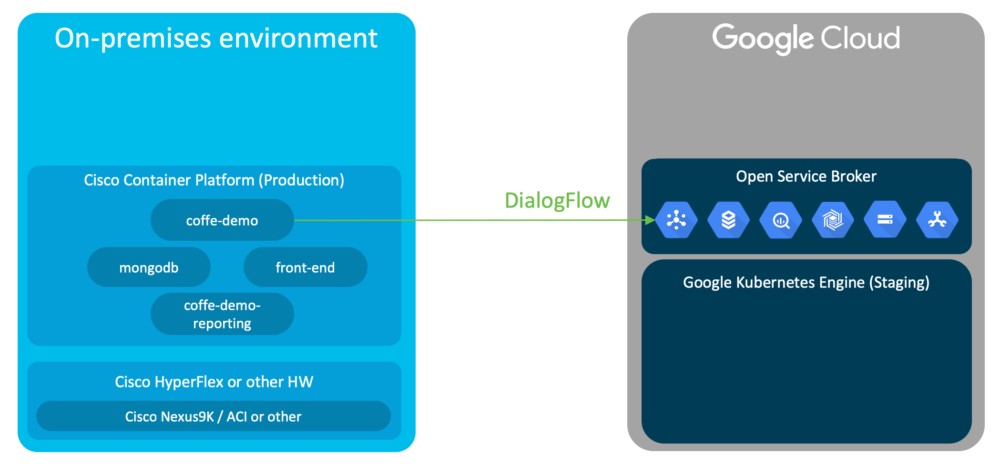
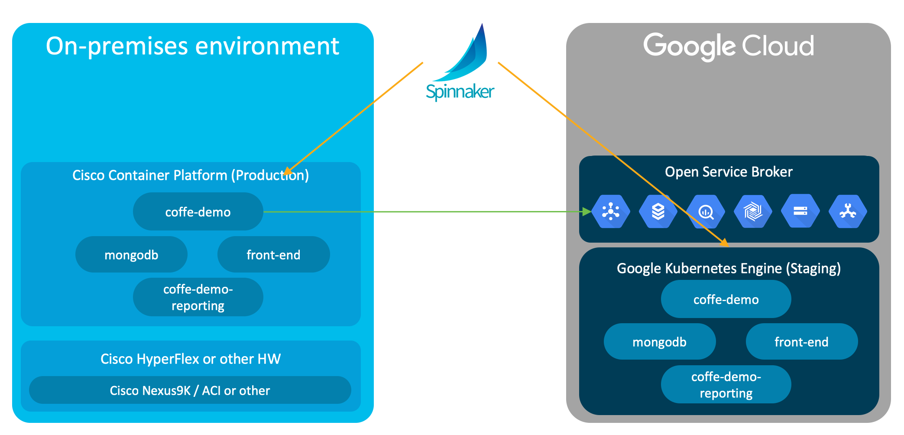

# Coffee Demo
## Overview

This demo shows two use-cases for hybrid cloud Kubernetes clusters using Cisco Container Platform and Google Cloud Platform. Both use-cases are centred around the same application - an employee coffee store for a large company. In this scenario, the application stores sensitive data (employee's account balance and coffee orders), so running production instances on-premises is preferred. The application is based on a micro-services architecture with 4 services:

* **mongodb** - persistence
* **coffee-demo-app** - order processing service written in Go - [GitHub](https://github.com/cgascoig/coffee-demo-app) - [Docker Hub](https://hub.docker.com/r/cgascoig/coffee-demo-app/)
* **coffee-demo-reporting** - reporting service written in Go - [GitHub](https://github.com/cgascoig/coffee-demo-reporting) - [Docker Hub](https://hub.docker.com/r/cgascoig/coffee-demo-reporting/)
* **coffee-demo-front-end** - web front-end HTML, CSS and JS. Also provides reverse proxying via nginx for -app and -reporting services - [GitHub](https://github.com/cgascoig/coffee-demo-front-end) - [Docker Hub](https://hub.docker.com/r/cgascoig/coffee-demo-front-end/)

### Use-case 1



In this use-case, the production instance of the application is running in an on-premises Kubernetes cluster managed by the Cisco Container Platform. The order processing micro-service leverages Google DialogFlow for natural language processing so that users can simply speak their order via the microphone or type their order using a free text input field. 

### Use case 2



In this use-case, we show a CI/CD workflow where the test/staging instance runs in GCP (on a Google Kubernetes Engine cluster) and the production instance runs in an on-premises Kubernetes cluster managed by the Cisco Container Platform. The CI/CD workflow is managed by Spinnaker. 

## Setup

### Deploying Kubernetes clusters and Spinnaker

Create staging cluster on GKE: 
```
gcloud container clusters create gke-staging --no-enable-cloud-logging --no-enable-cloud-monitoring --num-nodes=2
```

Create service account on GKE cluster:
```
# export KUBECONFIG=
kubectl create serviceaccount spinnaker
kubectl create clusterrolebinding spinnaker-cluster-admin --clusterrole=cluster-admin --serviceaccount=default:spinnaker
GKE_TOKEN=$(kubectl get secret $(kubectl get serviceaccount spinnaker -o jsonpath='{.secrets[0].name}') -o jsonpath='{.data.token}' | base64 -D )
GKE_SERVER=$(kubectl config view -o jsonpath='{.clusters[0].cluster.server}')
```

Create cluster on CCP and download environment file to `~/Downloads/ccp-prod.env`. 

Install spinnaker on CCP cluster:
```
export KUBECONFIG=~/Downloads/ccp-prod.env

helm init --upgrade

kubectl create ns spinnaker

helm install --name spin-release stable/spinnaker --timeout 600 --namespace spinnaker
```


Configure Spinnaker:

```
# export KUBECONFIG=~/Downloads/ccp-prod.env

# Create a new kubeconfig file in the halyard pod:

kubectl -n spinnaker exec spin-release-spinnaker-halyard-0 -- bash -c "export KUBECONFIG=~/gke-staging.env; kubectl config set-cluster gke-staging --server $GKE_SERVER --insecure-skip-tls-verify"
kubectl -n spinnaker exec spin-release-spinnaker-halyard-0 -- bash -c "export KUBECONFIG=~/gke-staging.env; kubectl config set-credentials gke-staging --token=\"$GKE_TOKEN\""
kubectl -n spinnaker exec spin-release-spinnaker-halyard-0 -- bash -c "export KUBECONFIG=~/gke-staging.env; kubectl config set-context gke-staging --cluster gke-staging --user gke-staging"

# Add a new kubernetes account to Spinnaker's halyard configuration

kubectl -n spinnaker exec spin-release-spinnaker-halyard-0 -- bash -c "hal config provider kubernetes account add gke-staging --context gke-staging --kubeconfig-file ~/gke-staging.env  --docker-registries dockerhub --provider-version v2"

# Tell halyard to update Spinnaker's configuration:

kubectl -n spinnaker exec spin-release-spinnaker-halyard-0 -- bash -c "hal deploy apply"

# Create a NodePort for Spinnaker's UI and work out the URL:

kubectl -n spinnaker expose svc spin-deck --type NodePort  --name=spin-deck-np
SPINNAKER_URL="http://$(kubectl get nodes -o jsonpath='{.items[0].status.addresses[0].address}'):$(kubectl -n spinnaker get svc spin-deck-np -o jsonpath='{.spec.ports[0].nodePort}')"
echo "Access spinnaker UI at $SPINNAKER_URL"

# Create a NodePort for Spinnaker's Gate service and work out the URL:

kubectl -n spinnaker expose svc spin-gate --type NodePort  --name=spin-gate-np
SPINNAKER_GATE_URL="http://$(kubectl get nodes -o jsonpath='{.items[0].status.addresses[0].address}'):$(kubectl -n spinnaker get svc spin-gate-np -o jsonpath='{.spec.ports[0].nodePort}')"
echo "Spinnaker Gate URL: $SPINNAKER_GATE_URL"
```

### Setup DialogFlow key

At this stage, the coffee-demo-app service uses a fixed (hard coded) DialogFlow Agent running in GCP. In order to use this a GCP service account private key file is required. Please contact me to obtain this. 

The GCP service account private key file needs to be uploaded to both the staging and production Kubernetes clusters as a Kubernetes secret:

```
export KUBECONFIG=~/Downloads/ccp-prod.env
kubectl create ns coffee-demo
kubectl -n coffee-demo create secret generic dialogflow-key --from-file keys/dialogflowclient-key.json

export KUBECONFIG=
kubectl create ns coffee-demo
kubectl -n coffee-demo create secret generic dialogflow-key --from-file keys/dialogflowclient-key.json
```

### Configure Spinnaker pipelines

Install spin cli on local workstation. For MacOS see below (for other platforms see [these instructions](https://www.spinnaker.io/guides/spin/cli/#install-spin)):
```
curl -LO https://storage.googleapis.com/spinnaker-artifacts/spin/1.1.1/darwin/amd64/spin
chmod +x spin
sudo mv spin /usr/local/bin/spin
```

Create application and pipelines in Spinnaker
```
spin --gate-endpoint $SPINNAKER_GATE_URL application save --application-name coffee-demo --owner-email demo@none.com --cloud-providers kubernetes

spin --gate-endpoint $SPINNAKER_GATE_URL pipeline save --file spin/DeployToProd
spin --gate-endpoint $SPINNAKER_GATE_URL pipeline save --file spin/DeployToStaging
spin --gate-endpoint $SPINNAKER_GATE_URL pipeline save --file spin/ValidateStaging
```


## Running demo
### Preparation
To be completed